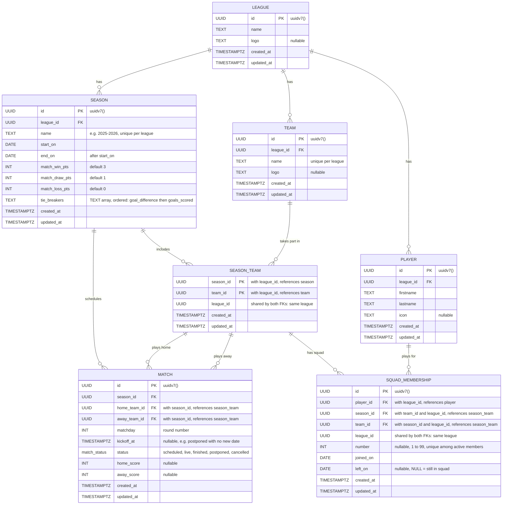

# Project league-s

One Paragraph of project description goes here

## Getting Started

These instructions will get you a copy of the project up and running on your local machine for development and testing purposes. See deployment for notes on how to deploy the project on a live system.

## Database schema

The app is multi-tenant: each league is an independent space run by its own
organizers. Teams and players belong to exactly one league (someone playing in
two leagues has two player records). Their participation in a season or a squad
is a dated relation, so past seasons stay consultable.



Design notes:

- **Leagues never mix, enforced twice.** Every query is filtered by the `leagueID` of the URL, so a resource of another league is simply not found (404). Underneath, composite foreign keys on `(id, league_id)` make the database refuse a team, a season or a player of another league, even if the code has a bug.
- **Rules live on the season, not the league.** Changing a competition's rules must not rewrite past standings.
- **Standings are not stored.** They are computed from finished matches with the season's rules, so there is a single source of truth.
- **Composite foreign keys** on `(season_id, team_id)` guarantee in the database that a match or a squad only involves teams registered for that season.
- **A player can leave and come back.** Each stint at a club is one `squad_membership` row, so a mid-season transfer or a return after a season away is just another row. The shirt number belongs to the stint, not to the player.
- **History is protected.** Deleting a league, a team or a player that has history is refused (`ON DELETE RESTRICT`).

## API

Every resource belongs to a league, so it lives under `/api/v1/leagues/{leagueID}`.

| Method | Path | Description |
|---|---|---|
| `POST` | `/api/v1/leagues` | Create a league |
| `GET` | `/api/v1/leagues` | List the leagues |
| `GET` | `/api/v1/leagues/{leagueID}` | Get a league |
| `DELETE` | `/api/v1/leagues/{leagueID}` | Delete a league (refused if it has history) |
| `POST` | `/api/v1/leagues/{leagueID}/teams` | Create a team |
| `GET` | `/api/v1/leagues/{leagueID}/teams` | List the teams of a league |
| `GET` | `/api/v1/leagues/{leagueID}/teams/{teamID}` | Get a team |
| `POST` | `/api/v1/leagues/{leagueID}/players` | Create a player |
| `GET` | `/api/v1/leagues/{leagueID}/players/{playerID}` | Get a player |
| `POST` | `/api/v1/leagues/{leagueID}/seasons` | Create a season |
| `GET` | `/api/v1/leagues/{leagueID}/seasons/{seasonID}` | Get a season |
| `GET` | `/api/v1/leagues/{leagueID}/seasons/{seasonID}/teams` | List the teams registered in a season |
| `POST` | `/api/v1/leagues/{leagueID}/seasons/{seasonID}/teams/{teamID}` | Register a team in a season |
| `DELETE` | `/api/v1/leagues/{leagueID}/seasons/{seasonID}/teams/{teamID}` | Unregister a team (refused if it has matches) |

## MakeFile

Run build make command with tests
```bash
make all
```

Build the application
```bash
make build
```

Run the application
```bash
make run
```
Create DB container
```bash
make docker-run
```

Shutdown DB Container
```bash
make docker-down
```

Live reload the application:
```bash
make watch
```

Run the unit tests (no Docker needed):
```bash
make test
```

Run the integration tests (test files tagged `//go:build integration`, needs Docker):
```bash
make itest
```

Run the linters (needs [golangci-lint](https://golangci-lint.run/docs/welcome/install/)):
```bash
make lint
```

Format the code and group the imports:
```bash
make fmt
```

Clean up binary from the last build:
```bash
make clean
```
