# Project league-s

One Paragraph of project description goes here

## Getting Started

These instructions will get you a copy of the project up and running on your local machine for development and testing purposes. See deployment for notes on how to deploy the project on a live system.

## Database schema

Teams and players are permanent identities; their participation in a season or a
squad is a dated relation, so past seasons stay consultable.

```mermaid
erDiagram
    LEAGUE ||--o{ SEASON : has
    SEASON ||--o{ SEASON_TEAM : includes
    TEAM ||--o{ SEASON_TEAM : "takes part in"
    SEASON ||--o{ MATCH : schedules
    SEASON_TEAM ||--o{ MATCH : "plays home"
    SEASON_TEAM ||--o{ MATCH : "plays away"
    SEASON_TEAM ||--o{ TEAM_MEMBERSHIP : "has squad"
    PLAYER ||--o{ TEAM_MEMBERSHIP : "plays for"

    LEAGUE {
        BIGSERIAL id PK
        TEXT name
        TEXT logo "nullable"
        TIMESTAMPTZ created_at
        TIMESTAMPTZ updated_at
    }

    SEASON {
        BIGSERIAL id PK
        BIGINT league_id FK
        TEXT name "e.g. 2025-2026, unique per league"
        DATE start_on
        DATE end_on "after start_on"
        INT match_win_pts "default 3"
        INT match_draw_pts "default 1"
        INT match_loss_pts "default 0"
        TEXT tie_breakers "TEXT array, ordered: goal_difference then goals_for"
        TIMESTAMPTZ created_at
        TIMESTAMPTZ updated_at
    }

    TEAM {
        BIGSERIAL id PK
        TEXT name "unique"
        TEXT logo "nullable"
        TIMESTAMPTZ created_at
        TIMESTAMPTZ updated_at
    }

    SEASON_TEAM {
        BIGINT season_id PK "FK to season"
        BIGINT team_id PK "FK to team"
        TIMESTAMPTZ created_at
        TIMESTAMPTZ updated_at
    }

    PLAYER {
        BIGSERIAL id PK
        TEXT firstname
        TEXT lastname
        TIMESTAMPTZ created_at
        TIMESTAMPTZ updated_at
    }

    TEAM_MEMBERSHIP {
        BIGSERIAL id PK
        BIGINT player_id FK
        BIGINT season_id FK "with team_id, references season_team"
        BIGINT team_id FK "with season_id, references season_team"
        INT number "nullable, 1 to 99, unique among active members"
        DATE joined_on
        DATE left_on "nullable, NULL = still in squad"
        TIMESTAMPTZ created_at
        TIMESTAMPTZ updated_at
    }

    MATCH {
        BIGSERIAL id PK
        BIGINT season_id FK
        BIGINT home_team_id FK "with season_id, references season_team"
        BIGINT away_team_id FK "with season_id, references season_team"
        INT matchday "round number"
        TIMESTAMPTZ kickoff_at "nullable, e.g. postponed with no new date"
        match_status status "scheduled, live, finished, postponed, cancelled"
        INT home_score "nullable"
        INT away_score "nullable"
        TIMESTAMPTZ created_at
        TIMESTAMPTZ updated_at
    }
```



Design notes:

- **Rules live on the season, not the league.** Changing a competition's rules must not rewrite past standings.
- **Standings are not stored.** They are computed from finished matches with the season's rules, so there is a single source of truth.
- **Composite foreign keys** on `(season_id, team_id)` guarantee in the database that a match or a squad only involves teams registered for that season.
- **A player can leave and come back.** Each stint at a club is one `team_membership` row, so a mid-season transfer or a return after a season away is just another row. The shirt number belongs to the stint, not to the player.
- **History is protected.** Deleting a league, a team or a player that has history is refused (`ON DELETE RESTRICT`).

## MakeFile

Run build make command with tests
```bash
make all
```

Build the application
```bash
make build
```

Run the application
```bash
make run
```
Create DB container
```bash
make docker-run
```

Shutdown DB Container
```bash
make docker-down
```

DB Integrations Test:
```bash
make itest
```

Live reload the application:
```bash
make watch
```

Run the test suite:
```bash
make test
```

Clean up binary from the last build:
```bash
make clean
```
